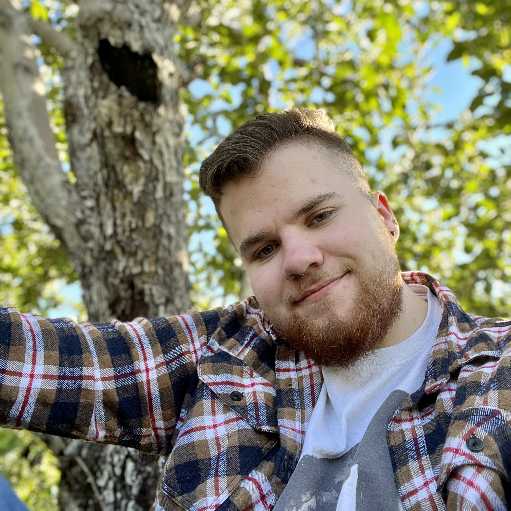

# Journal de "Michaël simard"

* [Semaine 1](#semaine-1)
* [Semaine 2](#semaine-2)
* [Semaine 3](#semaine-3)
* [Semaine 4](#semaine-4)
* [Semaine 5](#semaine-5)
* [Semaine de rattrapage](#semaine-de-rattrapage)
* [Semaine 6](#semaine-6)
* [Semaine 7](#semaine-7)
* [Semaine 8](#semaine-8)
* [Semaine 9](#semaine-9)

## Semaine 1

### Résumé des réalisations effectuées
- Continuation de la préproduction.
- Création de la V1 de la vidéo de présentation.

### Image d'une réalisation dont tu es la ou le plus fier

### Est-ce que j'ai accompli l'ensemble des tâches et objectifs que je m'étais fixés pour cette semaine?	
- [ ] Complètement
- [x] Assez
- [ ] Peu
- [ ] Pas du tout

#### Décrivez pourquoi.
- Rendus au vendredi, nous n'avions pas encore terminé notre vidéo et nous prévoyons de la terminer dimanche 29 janvier 2023

#### S'il y a lieu, qu'allez-vous faire pour remédier à la situation?
Nunc cursus dapibus congue. Nunc tristique commodo neque, vel iaculis turpis congue quis. Integer nec lobortis nisl, sit amet lacinia justo. Sed porta magna at nunc semper, quis vestibulum elit fermentum.

### Mon projet s'est-il réalisé selon l’échéancier prévu?

- [ ] Complètement
- [x] Assez
- [ ] Un peu
- [ ] Pas tout à fait

#### S'il y a des écarts, décrivez-les.

#### S'il y a lieu, qu'allez-vous faire pour remédier à la situation?

### Défis pour la prochaine semaine
Avancer 

---
## Semaine 2
---
## Semaine 3 
---
## Semaine 4
---
## Semaine 5
---
## Semaine de rattrapage

## Semaine 6
---
## Semaine 7
---
## Semaine 8
---
## Semaine 9
