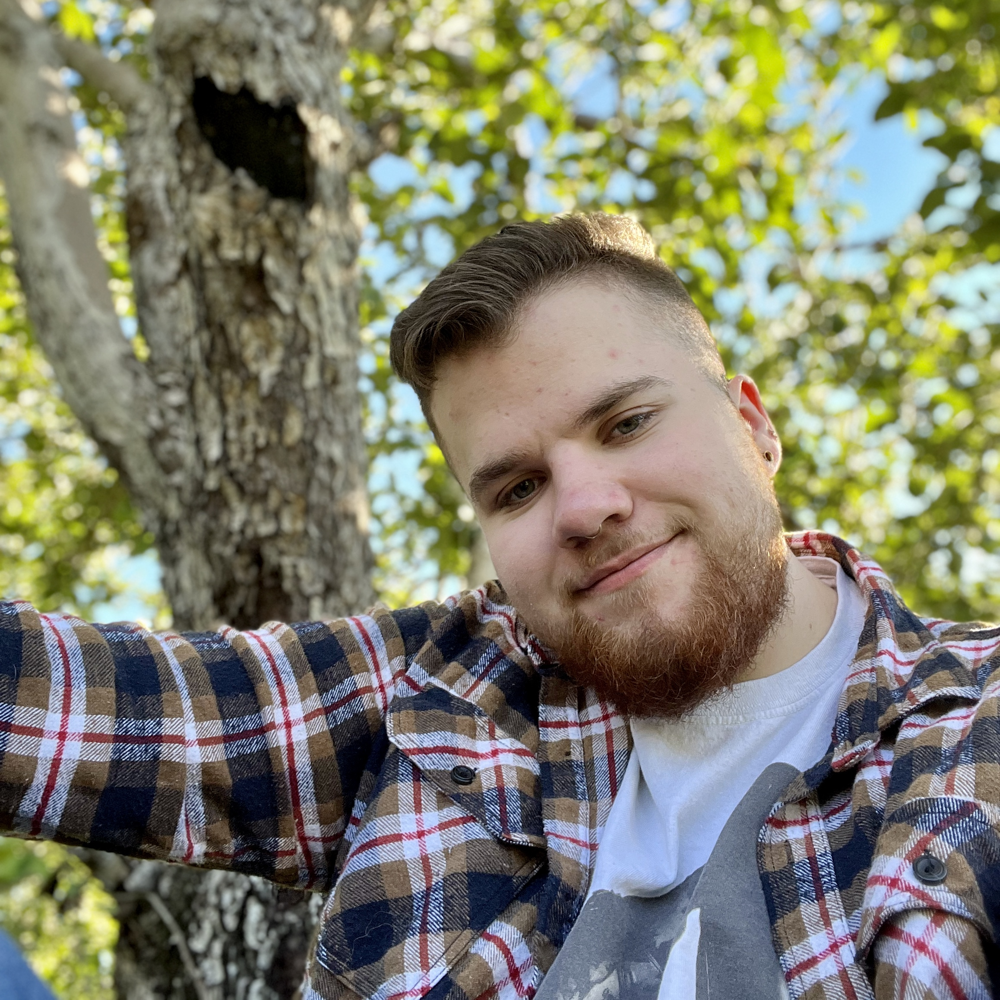

# Journal de "Michaël simard"

* [Semaine 1](#semaine-1)
* [Semaine 2](#semaine-2)
* [Semaine 3](#semaine-3)
* [Semaine 4](#semaine-4)
* [Semaine 5](#semaine-5)
* [Semaine de rattrapage](#semaine-de-rattrapage)
* [Semaine 6](#semaine-6)
* [Semaine 7](#semaine-7)
* [Semaine 8](#semaine-8)
* [Semaine 9](#semaine-9)

## Semaine 1

### Résumé des réalisations effectuées
- Révision et modification de la préproduction.
- Création de la V1 de la vidéo de présentation.

### Image d'une réalisation dont tu es la ou le plus fier

(Simulation/Rendue 3D faits avec Éloïse pour permettre de mieux comprend à quoi notre projet pourra ressembler)

### Est-ce que j'ai accompli l'ensemble des tâches et objectifs que je m'étais fixés pour cette semaine?	
- [ ] Complètement
- [x] Assez
- [ ] Peu
- [ ] Pas du tout

#### Décrivez pourquoi.
- Nous n'avons pas totalement fini la révision de notre préproduction, parce que au fil des rencontres, durant la semaine, il y a eu quand même beaucoup de changements. Néanmoins, le projet est beaucoup moins flou eut au début de la semaine et semble beaucoup plus réalisable et plus focalisé sur ce qui est important plutôt que sur la quantité.

#### S'il y a lieu, qu'allez-vous faire pour remédier à la situation?
- Je vais bien sûr continuer durant la fin de semaine à avancer sur la vidéo et la révision plus approfondie de la préproduction, pour m'assurer que tout sera fini dans les temps.

### Mon projet s'est-il réalisé selon l’échéancier prévu?

- [ ] Complètement
- [x] Assez
- [ ] Un peu
- [ ] Pas tout à fait

#### S'il y a des écarts, décrivez-les.
Pour l'instant, je dirais que nous sommes quand même dans les temps. Cependant, je crois que je vais tout de même devoir perfectionner et développer encore plusieurs partis de la préproduction.

#### S'il y a lieu, qu'allez-vous faire pour remédier à la situation?
Je crois que je vais devoir pauser plus de question sur ce que j'ai besoin d'aide.

### Défis pour la prochaine semaine
Avancer sur le budget pour pouvoir le remettre avant la fin de la semaine et pouvoir commander ce qu'il nous faut. Aussi, je vais devoir regarder de façon plus approfondie sur comment construire le circuit qui se trouvera à l'intérieur du vélo

---
## Semaine 2

### Résumé des réalisations effectuées
- Coordination du projet( Séparation des taches).
- Création de visuel pour la video d'intention V2.
- Ajout d'issue pour le futur du projet.
- Production de la vidéo.
- Mise en place du budget final.

### Image d'une réalisation dont tu es la ou le plus fier

(J'ai refait une simulation plus réaliste pour notre projet.)

### Est-ce que j'ai accompli l'ensemble des tâches et objectifs que je m'étais fixés pour cette semaine?	
- [X] Complètement
- [ ] Assez
- [ ] Peu
- [ ] Pas du tout

#### Décrivez pourquoi.
- Oui, j'ai fait toutes les taches que je m'étais assigné la semaine dernière et même plus. Donc, je suis satisfait de mon travail.

#### S'il y a lieu, qu'allez-vous faire pour remédier à la situation?
X
### Mon projet s'est-il réalisé selon l’échéancier prévu?

- [x] Complètement
- [ ] Assez
- [ ] Un peu
- [ ] Pas tout à fait

#### S'il y a des écarts, décrivez-les.
Je crois encore que nous sommes dans les temps. Parce que dès que nous avons un problème, nous nous rencontrons rapidement pour remédier à ce problème. De plus, cette semaine nous nous sommes pris moins à la dernière minute pour faire la vidéo. ce qui est positif et avons terminé plus de te tâche que supposé.

#### S'il y a lieu, qu'allez-vous faire pour remédier à la situation?
X

### Défis pour la prochaine semaine
J'aimerais pour la semaine prochaine, débuter le prototypage sur le vélo et continuer de déployer des issu pour prévoir la suite du projet à l'avance

---
## Semaine 3
---

### Résumé des réalisations effectuées
- Coordination du projet( Séparation des taches).
- Gestion des articles a commander.
- Ajout de média à notre liste.
- Mise en place dune fichier qui simule les datait d'un vélo.

### Image d'une réalisation dont tu es la ou le plus fier

(J'ai commencé a faire les fichier pour simuler un moteur.)

### Est-ce que j'ai accompli l'ensemble des tâches et objectifs que je m'étais fixés pour cette semaine?	
- [ ] Complètement
- [X] Assez
- [ ] Peu
- [ ] Pas du tout

#### Décrivez pourquoi.
- Plus ou moins, parce que cette semaine je voulais commencer à travailler sur le prototypage du vélo mais malheureusement je n'avais pas de vélo donc j'ai dû mettre en place un fichier pour simuler la présence d'un vélo.

#### S'il y a lieu, qu'allez-vous faire pour remédier à la situation?
- Heureusement, la semaine prochaine je devrais commencer à avoir le matériel pour débuter le prototypage.

### Mon projet s'est-il réalisé selon l’échéancier prévu?

- [x] Complètement
- [ ] Assez
- [ ] Un peu
- [ ] Pas tout à fait

#### S'il y a des écarts, décrivez-les.
- Oui, ce que j'ai fait cette semaine a finalement tout été terminé.

#### S'il y a lieu, qu'allez-vous faire pour remédier à la situation?
X

### Défis pour la prochaine semaine
J'aimerais pour la semaine prochaine vraiment vraiemtn commancer a travailer sur le circuit du vélo.

---
## Semaine 4
---
## Semaine 5
---
## Semaine de rattrapage

## Semaine 6
---
## Semaine 7
---
## Semaine 8
---
## Semaine 9
