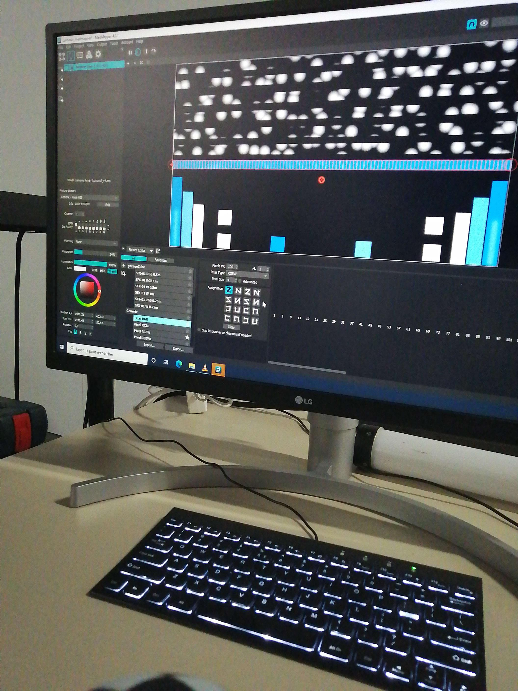
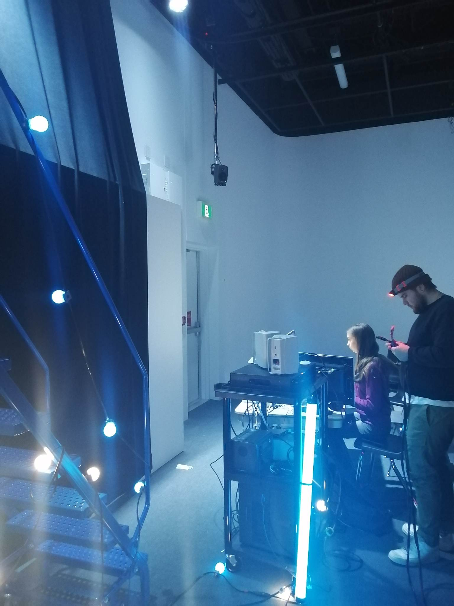

# Journal de "Pénélope Morrisson"

* [Semaine 1](#semaine-1)
* [Semaine 2](#semaine-2)
* [Semaine 3](#semaine-3)
* [Semaine 4](#semaine-4)
* [Semaine 5](#semaine-5)
* [Semaine de rattrapage](#semaine-de-rattrapage)
* [Semaine 6](#semaine-6)
* [Semaine 7](#semaine-7)
* [Semaine 8](#semaine-8)
* [Semaine 9](#semaine-9)

## Semaine 1

### Résumé des réalisations effectuées
- Discussion en équipe des changements pour le projet (Budget , équipement , endroit )
- Discussion en équipe pour la mise à jour de la grille de budget en équipe et la liste des équiements 
- Mise à jour cartographie (La localisation du projet est proche de la porte 3 )
- Mise à jour de l'intention et synopsis
- Mise à jour de l'inventaire du contenu multimédia

### Image d'une réalisation dont tu es la ou le plus fier

### Est-ce que j'ai accompli l'ensemble des tâches et objectifs que je m'étais fixés pour cette semaine?	
- [x] Complètement
- [ ] Assez
- [ ] Peu
- [ ] Pas du tout

#### Décrivez pourquoi.

#### S'il y a lieu, qu'allez-vous faire pour remédier à la situation?

### Mon projet s'est-il réalisé selon l’échéancier prévu?

- [ ] Complètement
- [x] Assez
- [ ] Un peu
- [ ] Pas tout à fait

#### S'il y a des écarts, décrivez-les.

#### S'il y a lieu, qu'allez-vous faire pour remédier à la situation?

### Défis pour la prochaine semaine
- Finir la vidéo présentation
- Finir la liste du budget avec lien pour l'équipement si ce n'est pas déjà finis
- Prévoir une trame sonore
- Réunion d'équipe 29 janvier 2023

---
## Semaine 2
### Résumé des réalisations effectuées
- Faire le scenarimage
- Mettre à jour le synopsis
- Choisir la couleur pour les lumières
- Répartition des tâches en équipes

### Image d'une réalisation dont tu es la ou le plus fier

### Est-ce que j'ai accompli l'ensemble des tâches et objectifs que je m'étais fixés pour cette semaine?

- [ ] Complètement
- [x] Assez
- [ ] Peu
- [ ] Pas du tout

#### Décrivez pourquoi.
 Parce que c'est beaux et je suis satifaite de mon travail.

#### S'il y a lieu, qu'allez-vous faire pour remédier à la situation?
Je vais faire des modifications pour la couleurs du idles (lumière) je crois. Il va falloir faire des tests en temps réel

### Mon projet s'est-il réalisé selon l’échéancier prévu?

- [ ] Complètement
- [x] Assez
- [ ] Un peu
- [ ] Pas tout à fait

#### S'il y a des écarts, décrivez-les.
-Finir le journal, j'ai eu des imprévus.

#### S'il y a lieu, qu'allez-vous faire pour remédier à la situation?
-Le finir le plus tôt possible

### Défis pour la prochaine semaine
-Travailler la lumière sur madmapper avec Skyla
-Écrire le texte pour le comité communication

---
## Semaine 3 
### Résumé des réalisations effectuées
-Écrire le texte pour le comité communication
-Discussion équipe mercredi avec Daryl
-Planifier la procédure pour faire la vidéo avec madmapper

### Image d'une réalisation dont tu es la ou le plus fier

### Est-ce que j'ai accompli l'ensemble des tâches et objectifs que je m'étais fixés pour cette semaine?

- [ ] Complètement
- [ ] Assez
- [x] Peu
- [ ] Pas du tout

#### Décrivez pourquoi.
 Parce que nous n'avons pas encore commencer les vidéos pour la lumière sur madmapper mais il est prévu de commencer cela le 9 février.

#### S'il y a lieu, qu'allez-vous faire pour remédier à la situation?
Nous avons prévu un moment pour le faire le plus tôt possible (dont demain)

### Mon projet s'est-il réalisé selon l’échéancier prévu?

- [ ] Complètement
- [x] Assez
- [ ] Un peu
- [ ] Pas tout à fait

#### S'il y a des écarts, décrivez-les.

Non avons finis la pré-production, il reste juste a commencer a faire la vidéo pour la lumière et la trame sonore. Il fallait prioriser la prise la trame sonore avant la lumière. Il faut aussi prendre la photo a l'extérieur.
#### S'il y a lieu, qu'allez-vous faire pour remédier à la situation?
Prendre la photo demain et planifier en avance.

### Défis pour la prochaine semaine
-Prendre photo des lieux la nuit
-Vidéo lumière pour madmapper

---
## Semaine 4
### Résumé des réalisations effectuées
-Vidéo lumière hiver
-Test madmapper des lumières
-Photo nuit
-Text pour commité communication

### Image d'une réalisation dont tu es la ou le plus fier

### Est-ce que j'ai accompli l'ensemble des tâches et objectifs que je m'étais fixés pour cette semaine?

- [ ] Complètement
- [x] Assez
- [ ] Peu
- [ ] Pas du tout

#### Décrivez pourquoi.
 J'ai finis la vidéo lumière pour hiver. Cela fait pas l'effet que j'avais espéré au départ, mais cela reste beau.

#### S'il y a lieu, qu'allez-vous faire pour remédier à la situation?
Chercher des ressources ou demander de l'aide au profs sur after effect, mais je vais priorisé d'autres tâches à accomplir que de perfectionné ce qui est déjà satisfaisant.

### Mon projet s'est-il réalisé selon l’échéancier prévu?

- [x] Complètement
- [ ] Assez
- [ ] Un peu
- [ ] Pas tout à fait

#### S'il y a des écarts, décrivez-les.
J'avais voulu aussi faire la vidéo de lumière pour automne aussi, mais cela aurait été irréalisable.

#### S'il y a lieu, qu'allez-vous faire pour remédier à la situation?
Je vais le faire la semaine prochaine, je l'ai déjà un peu commencer cette semaine.

### Défis pour la prochaine semaine
-Faire la vidéo pour la lumière sur After effect et la tester sur Madmapper
---
## Semaine 5
### Résumé des réalisations effectuées
-Vidéo lumière idle
-Vidéo lumière automne 
-tester les lumières 

### Image d'une réalisation dont tu es la ou le plus fier

### Est-ce que j'ai accompli l'ensemble des tâches et objectifs que je m'étais fixés pour cette semaine?

- [x] Complètement
- [ ] Assez
- [ ] Peu
- [ ] Pas du tout

#### Décrivez pourquoi.
 J'ai fait plus que demander car j'ai fait la vidéo idle qui était du pour la semaine prochaine.

#### S'il y a lieu, qu'allez-vous faire pour remédier à la situation?

### Mon projet s'est-il réalisé selon l’échéancier prévu?

- [x] Complètement
- [ ] Assez
- [ ] Un peu
- [ ] Pas tout à fait

#### S'il y a des écarts, décrivez-les.
J'ai fait tous ce qui était dû cette semaine

#### S'il y a lieu, qu'allez-vous faire pour remédier à la situation?

### Défis pour la prochaine semaine
-Tester d'avantage le rendu des lumières.
---
## Semaine de rattrapage
### Résumé des réalisations effectuées
-Rien j'étais malade

### Image d'une réalisation dont tu es la ou le plus fier

### Est-ce que j'ai accompli l'ensemble des tâches et objectifs que je m'étais fixés pour cette semaine?

- [ ] Complètement
- [ ] Assez
- [ ] Peu
- [x] Pas du tout

#### Décrivez pourquoi.
 
j'étais malade
#### S'il y a lieu, qu'allez-vous faire pour remédier à la situation?

### Mon projet s'est-il réalisé selon l’échéancier prévu?

- [ ] Complètement
- [x] Assez
- [ ] Un peu
- [ ] Pas tout à fait

#### S'il y a des écarts, décrivez-les.
j'étais malade, dinc je n'ai pas corriger la lumière jaune mais je suis encore dans les temps

#### S'il y a lieu, qu'allez-vous faire pour remédier à la situation?
Avancer cette semaine cette semaine

### Défis pour la prochaine semaine
Faire les correction pour les lumières
---
## Semaine 6
### Résumé des réalisations effectuées

-Correction des couleurs lumières pour automne et hiver
-Création de la vidéo de la lumière pour les luciols
-Tenter de la connection avec de l'arduino pour les led dans arbustes (luciole)
-

### Image d'une réalisation dont tu es la ou le plus fier

### Est-ce que j'ai accompli l'ensemble des tâches et objectifs que je m'étais fixés pour cette semaine?

- [x] Complètement
- [ ] Assez
- [ ] Peu
- [ ] Pas du tout

#### Décrivez pourquoi.
 

#### S'il y a lieu, qu'allez-vous faire pour remédier à la situation?

### Mon projet s'est-il réalisé selon l’échéancier prévu?

- [ ] Complètement
- [x] Assez
- [ ] Un peu
- [ ] Pas tout à fait

#### S'il y a des écarts, décrivez-les.
J'ai pris légerement du retard car j'étais malade la semaine passée. Mais j'ai finalisée le contenue médiatique qui m'était assigné.

#### S'il y a lieu, qu'allez-vous faire pour remédier à la situation?

### Défis pour la prochaine semaine
-Aidezr mon équipe a faire les installations dehors.
-Assurer le bon fonctionnement du projet
-Publicité de l'évènement
-Ajouter du contenue médiatique
-Pratiquer le poème

---
## Semaine 7
### Résumé des réalisations effectuées
-Aidez mon équipe pour les installations dehors
-branchement des fils
-Ajout du contenu médiatique
-Prise de photos et vidéo de l'équipe en travaille pour la gallerie d'image du site internet de l'école et pour la vidéo du projet

### Image d'une réalisation dont tu es la ou le plus fier

### Est-ce que j'ai accompli l'ensemble des tâches et objectifs que je m'étais fixés pour cette semaine?

- [ ] Complètement
- [x] Assez
- [ ] Peu
- [ ] Pas du tout

#### Décrivez pourquoi.
 Les photos sont pas visibles sur le site de l'école

#### S'il y a lieu, qu'allez-vous faire pour remédier à la situation?
Revérivier mon code sur gitup et demander l'aide aux profs.

### Mon projet s'est-il réalisé selon l’échéancier prévu?

- [x] Complètement
- [ ] Assez
- [ ] Un peu
- [ ] Pas tout à fait

#### S'il y a des écarts, décrivez-les.
Mises à part que les photos ne sont pas visibles sur le site, il faudrait retoucher au vidéo de lumières pour l'effet des led.

#### S'il y a lieu, qu'allez-vous faire pour remédier à la situation?
Faire ça le soir pour voir mieux le résultat des lumières et tester le site web.

### Défis pour la prochaine semaine
-refaire vidéo pour l'effet des leds
-faire le montage de la vidéo promotion
-faire les intervues
-ajouter tous les images sur le site une fois le problème résolu.

## Semaine 8

## Semaine 9
