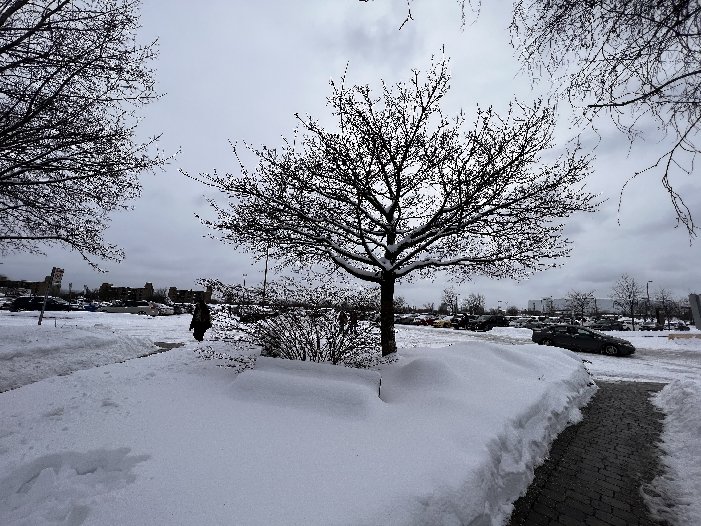
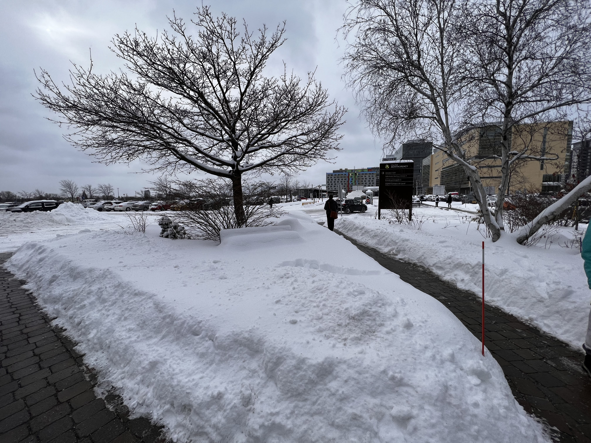
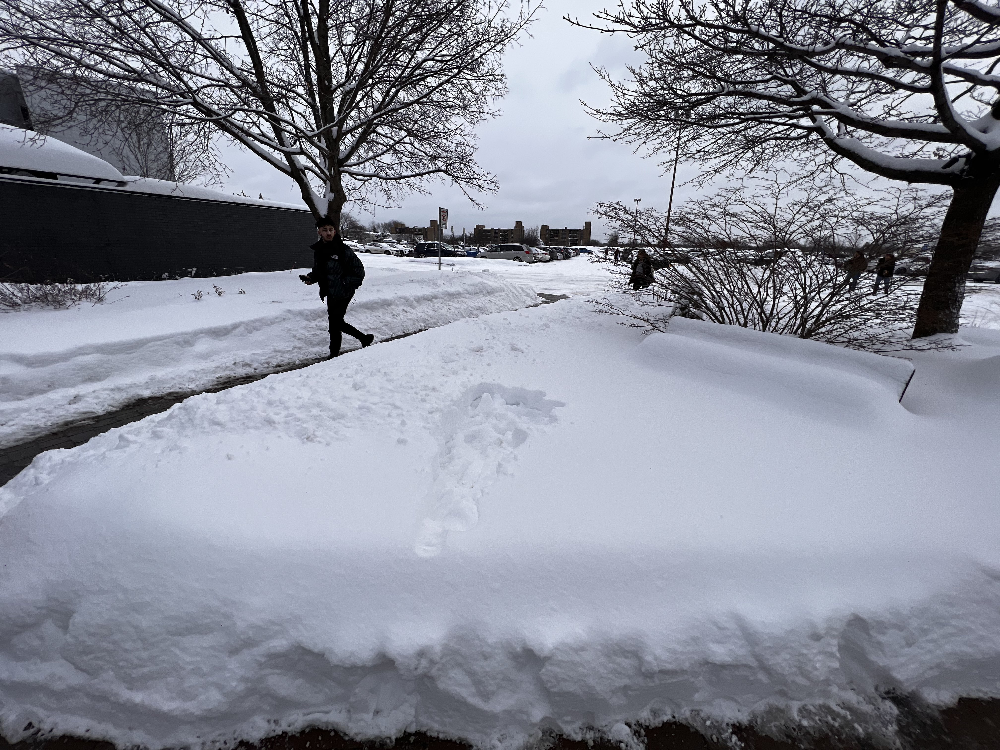
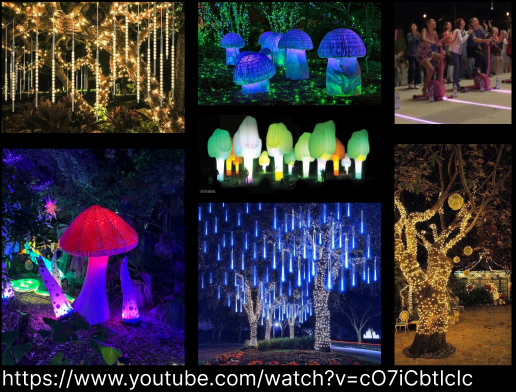
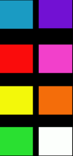
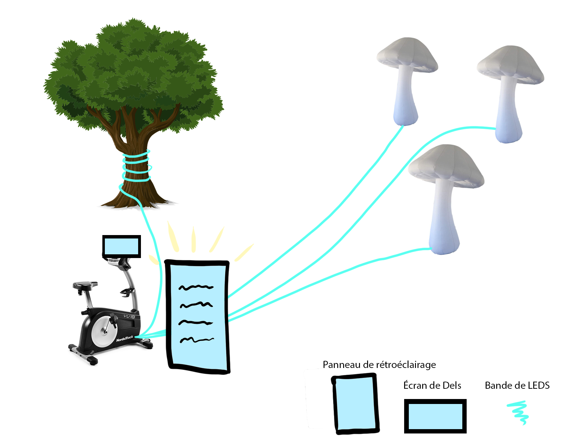
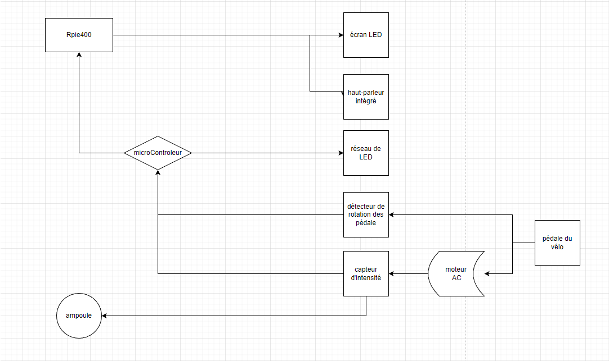
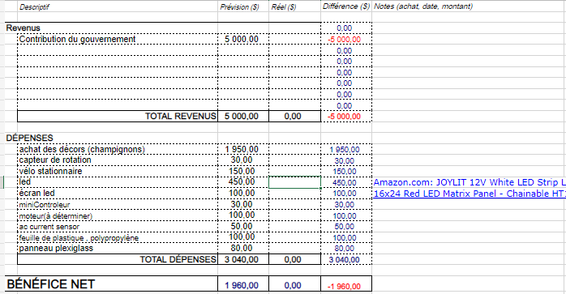

# Préproduction
> C'est ici qu'on dépose les éléments de la préproduction.

# Table des matières
1. [Intention ou concept](#Intention-ou-concept)
    - [Cartographie](#Cartographie)
    - [Intention de départ](#Intention-de-départ)
    - [Synopsis](#Synopsis)
    - [Tableau d'ambiance (*moodboard*)](#Tableau-d'ambiance-(*moodboard*))
    - [Scénario, scénarimage ou document audio/visuel](#Scénario,-scénarimage-ou-document-audio/visuel)
2. [Contenu multimédia à intégrer](#Contenu-multimédia-à-intégrer)
    - [Inventaire du contenu multimédia](#Inventaire-du-contenu-multimédia)
    - [Univers artistique des éléments](#Univers-artistique-des-éléments-centraux)
3. [Planification technique d'un prototype (devis technique)](#planification-technique-dun-prototype-devis-technique)
    - [Schémas ou plans techniques](#Schémas-ou-plans-techniques)
    - [Matériaux requis](#Matériaux-de-scénographie-requis)
    - [Équipements requis](#Équipements-requis)
    - [Logiciels requis](#Logiciels-requis)
    - [Ressources humaines requises](#Ressources-humaines-requises)
    - [Ressources spatiales requises (rangement et locaux)](#Ressources-spatiales-requises-(rangement-et-locaux))
    - [Contraintes techniques et potentiels problèmes de production](#Contraintes-techniques-et-potentiels-problèmes-de-production)
4. [Planification de la production d'un prototype (budget et étapes de réalisation)](#Planification-de-la-production-(budget-et-étapes-de-réalisation))
    - [Budget prévisionnel](#Budget-prévisionnel)
    - [Échéancier global](#Échéancier-global)
    - [Liste des tâches à réaliser](#Liste-des-tâches-à-réaliser)
    - [Rôles et responsabilités des membres de l'équipe](#Rôles-et-responsabilités-des-membres-de-l'équipe)
    - [Moments des rencontres d'équipe](#Moments-des-rencontres-d'équipe)

# Intention ou concept
## Cartographie
> Emplacement:

    
## Intention de départ
Dans le cadre de ce projet, nous voulons démontrer l'importance pour les humains de demeurer en contact avec la nature en raison de l'urgence climatique que nous vivons actuellement. C'est par l'action, en pédalant dans ce cas, qu'on peut avoir un impact positif sur l'environnement lumineux.

## Synopsis
Il s'agit d'une expérience multimédia où vous pouvez interagir avec la lumière et le son de la bicyclette fixe. Quand quelqu'un monte sur le vélo et pédale, cela illumine les leds qui entourent l'arbre et celles qui seront suspendues aux bouts de certaines branches. D'autres leds allumeront le pied des champignons. Toutes ces DEL s'éclairent à un certain rythme et s'arrêtent automatiquement dès que l'utilisateur arrête de pédaler. pour insister l'utilisateur a continué de pedaler, les leds augments de plus en plus. Il y aurait également une petite ampoule sur le velo qui montrerait toute la force nécessaire pour allumer une simple ampoule. pendant l'expérience une petite animation attachée à la moto stationnaire encourage l'utilisateur à continuer à pédaler.

## Tableau d'ambiance (*moodboard*)
### Référence
> 
### Couleurs
> 

## Scénario, scénarimage ou document audio/visuel

# Contenu multimédia à intégrer

## Inventaire du contenu multimédia

- 1 Modelisation de style holographique
- 1 bande sonore féérique

## Univers artistique des éléments
Voir colonne dans l'[Inventaire du contenu à intégrer](https://cmontmorency365-my.sharepoint.com/:x:/g/personal/2043528_cmontmorency_qc_ca/EV6CortYhXRHhYdXFVyNncMB1l6eHzHouDiJr-Jv7m2BKA?e=6enGIz).

# Planification technique d'un prototype (devis technique)
## Schémas ou plans techniques
### Schéma de branchement 

## Matériel de scénographie requis

> Liste des matériaux de scénographie 
* panneau plexiglass
* polypropylène
* Champignon gonflabe
* Vélo stationnaire

## Équipements requis
> Liste des équipements requis par département 

* Lumière
    * LED tube ws 2815?

* Électricité
    * 2 multiprise
    * 1 ac current sensor
    * 1 moteur

* Ordinateur
    * 1 ordinateur portable 
    
* Autre
    * 1 détecteur de rotation des pédales
    * 1 microControleur
    * 1 écran led
    

## Logiciels requis
> Liste des logiciels requis, version ainsi que leurs dépendences

* Arduino
* Blender
* Davinci
* Visual studio code
* OBS
* VCV

## Ressources humaines requises

* TTP, location de matériel
* interacteur X
* Instalateur LED spécialiser dans les arbres
* Etc.

## Ressources spatiales requises (rangement et locaux)
> Spécifications des espaces nécessaires formaté en liste ou lien vers un tableur Excel.

* Terrain face à l'école

# Planification de la production d'un prototype (budget et étapes de réalisation)
## Budget prévisionnel

[Lien vers document](https://cmontmorency365-my.sharepoint.com/:x:/g/personal/1750998_cmontmorency_qc_ca/EXqkXm99rPFGvh0DrXiERdsBS-l8X0qSRT5-CaJ0g_T6aQ?e=TR7tIV)

## Échéancier global
Étapes importantes du projet visualisé dans GitHub (*milestones*):  
https://github.com/Kawabongaaa/LumaSol/milestones

*Dates importantes :*
- Première itération : lundi x novembre
- Prototype finale : lundi x décembre
- Présentation des projets devant public : jeudi 25 mars (soir)

## Liste des tâches à réaliser
Visualisation des tâches à réaliser dans GitHub selon la méthode Kanban:  
https://github.com/orgs/Kawabongaaa/projects/2

Inventaire des tâches à réaliser dans GitHub selon le répertoire d'*issues*:  
https://github.com/tim-montmorency/66B-modele_de_projet/issues

## Rôles et responsabilités des membres de l'équipe
> Il vous est proposé ici de nommer une personne à la coordination générale du projet, à la coordination technique et à la coordination artistique. Les grandes décisions sur les grandes orientations du projet devraient se prendre en groupe lors de rencontres d'équipe. Cependant, les décisions entre vos rencontres de groupe devraient appartenir à ces personnes.

**Michaël**
- Coordination générale du projet
- [Issues GitHub assigné](https://github.com/Kawabongaaa/LumaSol/issues/assigned/MichaelSimardVaudry)

**Skayla**
- Coordination artistique
- [Issues GitHub assigné](https://github.com/Kawabongaaa/LumaSol/issues/assigned/skayla-nelie)

**Pénélope**
- Coordination artistique
- [Issues GitHub assigné](https://github.com/Kawabongaaa/LumaSol/issues/assigned/Penelope-M)

**Éloïse**
- Coordination technique
- [Issues GitHub assigné](https://github.com/Kawabongaaa/LumaSol/issues/assigned/Paracoco)

Liste des tâches dans Git Hub:  
- https://github.com/Kawabongaaa/LumaSol/issues 

**Tâches pas encore attribuées**  
- https://github.com/Kawabongaaa/LumaSol/issues?q=is%3Aissue+is%3Aopen+no%3Aassignee

## Moments des rencontres d'équipe
Hebdomadaire
- **Mardi, Samedi ,Dimanche(11h-12h)** : Rencontre de suivi de projet.

Autre: 
- **Lundi (vers 14h30), Vendredi(matin)** : Rencontre de suivi de projet.
