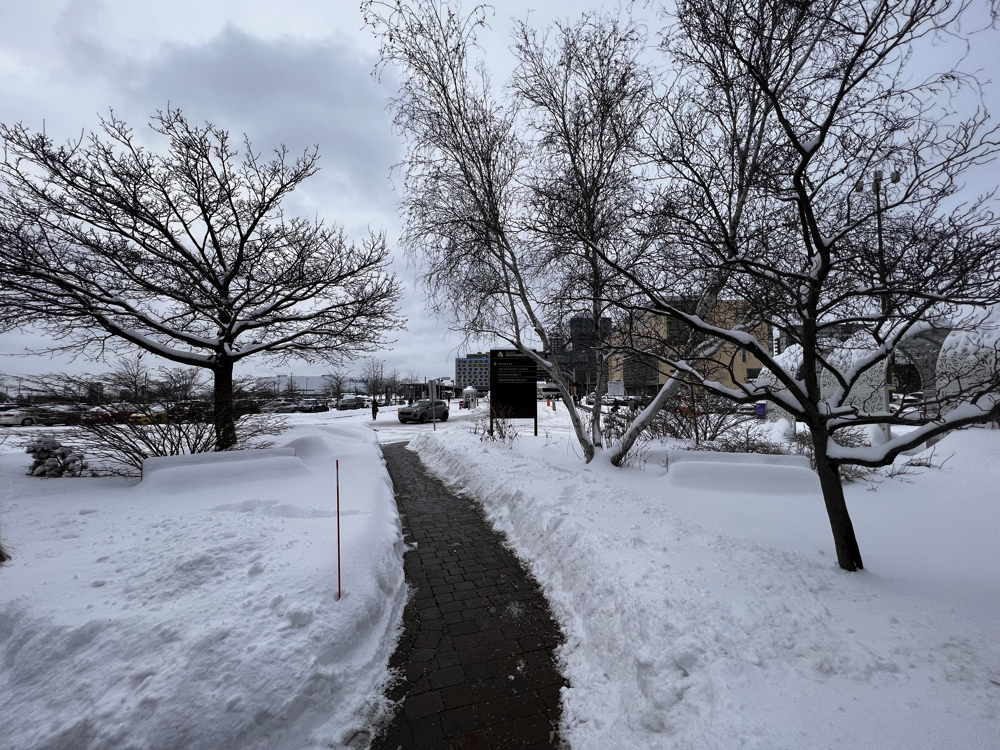

# Préproduction
> C'est ici qu'on dépose les éléments de la préproduction.

# Table des matières
1. [Intention ou concept](#Intention-ou-concept)
    - [Cartographie](#Cartographie)
    - [Intention de départ](#Intention-de-départ)
    - [Synopsis](#Synopsis)
    - [Tableau d'ambiance (*moodboard*)](#Tableau-d'ambiance-(*moodboard*))
    - [Scénario, scénarimage ou document audio/visuel](#Scénario,-scénarimage-ou-document-audio/visuel)
2. [Contenu multimédia à intégrer](#Contenu-multimédia-à-intégrer)
    - [Inventaire du contenu multimédia](#Inventaire-du-contenu-multimédia)
    - [Univers artistique des éléments](#Univers-artistique-des-éléments-centraux)
3. [Planification technique d'un prototype (devis technique)](#planification-technique-dun-prototype-devis-technique)
    - [Schémas ou plans techniques](#Schémas-ou-plans-techniques)
    - [Matériaux requis](#Matériaux-de-scénographie-requis)
    - [Équipements requis](#Équipements-requis)
    - [Logiciels requis](#Logiciels-requis)
    - [Ressources humaines requises](#Ressources-humaines-requises)
    - [Ressources spatiales requises (rangement et locaux)](#Ressources-spatiales-requises-(rangement-et-locaux))
    - [Contraintes techniques et potentiels problèmes de production](#Contraintes-techniques-et-potentiels-problèmes-de-production)
4. [Planification de la production d'un prototype (budget et étapes de réalisation)](#Planification-de-la-production-(budget-et-étapes-de-réalisation))
    - [Budget prévisionnel](#Budget-prévisionnel)
    - [Échéancier global](#Échéancier-global)
    - [Liste des tâches à réaliser](#Liste-des-tâches-à-réaliser)
    - [Rôles et responsabilités des membres de l'équipe](#Rôles-et-responsabilités-des-membres-de-l'équipe)
    - [Moments des rencontres d'équipe](#Moments-des-rencontres-d'équipe)

# Intention ou concept

## Intention de départ
Dans le cadre de ce projet, nous voulons démontrer l'importance pour les humains de demeurer en contact avec la nature en raison de l'urgence climatique que nous vivons actuellement. C'est par l'action, en pédalant dans ce cas, qu'on peut avoir un impact positif sur l'environnement lumineux. Le projet LumaSol donne la possibilité de rester en contact avec la nature.

## Synopsis
Il s'agit d'une expérience multimédia où vous pouvez interagir avec la lumière et un rythme musicale à partir d'un vélo stationnaire. Quand quelqu'un monte sur le vélo et pédale, cela illumine les Dels qui entourent l'arbre et celles qui seront suspendues aux bouts de certaines branches sous la forme de feuilles. D'autres DEl en forment de fleurs seront sur les plantes environnantes . Toutes ces DEL adressables s'éclairent selon le rythme de l'utilisateur et s'arrêtent automatiquement dès qu'il arrête de pédalé. Les couleurs sont prédéfinis en avance.

## Tableau d'ambiance (*moodboard*)
### Référence
> 
Couleur idle lumière

Couleur hiver lumière

Couleur printemps lumière

Couleur Automne lumière

Couleur Été lumière

## Scénario, scénarimage ou document audio/visuel	
État de veille :
Quelques spots de lumière sont installés à terre pour  éclairer l’arbre et le vélo en état de veille Avec une musique qui joue constamment.

Pédale :
Lorsque quelqu’un commence à pédaler sur le vélo, des bâtons lumineux  s’allume de chaque coté du vélo jusqu'à l’arbre suivit des boules dans l’arbre représentant des feuilles.

Boucle saisons :
Pendant tout le temps que la personne pédale, les lumières de l’arbre changerons en boucles représentant les 4 saisons accompagnées d’une trame sonore pour chaque saison.

Arrêt : 
Dès que l’utilisateur arrête de pédaler tout s’arrête et retourne doucement en état de veille.

# Contenu multimédia à intégrer

## Inventaire du contenu multimédia

| **Nbre** | **Nom**                       | **Description**                                                                                             | **À réaliser / À trouver** | **Format** | **Exemples de réalisation**                                                        |
|----------|-------------------------------|-------------------------------------------------------------------------------------------------------------|----------------------------|------------|------------------------------------------------------------------------------------|
| **1**    | Bande sonore, style détente   | Bande sonore qui jouera lors ce que personne n’est sur le vélo.                                             | À trouver                  | .wav ?     | https://www.youtube.com/watch?v=mX9zwLQVTr0&t=25391s&ab_channel=Sleep%26Relaxation |
| **2**    | Bande sonore relier au saison  | Bande sonore qui jouera lors ce qu’une personne commencera à pédaler sur le vélo avec une certaine intensité                               | À trouver                  | .wav ?     |  Inspiration Hiver :https://www.youtube.com/watch?v=5RHTt4_XVVU https://www.youtube.com/watch?v=HxmU48gyNZ8    Printemps:https://www.youtube.com/watch?v=u4pQ7O8uQRw    Été:https://www.youtube.com/watch?v=TkodnfN4kUQ        Automne: https://www.youtube.com/watch?v=v2qOllkxwiw   |

## Univers artistique des éléments
Voir colonne dans l'[Inventaire du contenu à intégrer](https://cmontmorency365-my.sharepoint.com/:x:/g/personal/2043528_cmontmorency_qc_ca/EV6CortYhXRHhYdXFVyNncMB1l6eHzHouDiJr-Jv7m2BKA?e=6enGIz).

# Planification technique d'un prototype (devis technique)
## Schémas ou plans techniques
### Schéma de branchement 

## Matériel de scénographie requis

> Liste des matériaux de scénographie 

* Vélo stationnaire

## Équipements requis
> Liste des équipements requis par département 

* Lumière
    * LED Strip DMX
    * DMX Dot String
    * Boules lumineuses 200mm
    * Boule lumineuses 36"
    * Tubes opal 1m, 1,5m, 2m
   

* Électricité
    * 2 multiprises
    * 2 ac current sensor
    * 2 moteurs
    * 2 microControleurs

* Ordinateur
    * 1 mac mini
    
* Autre
    * 2 détecteurs de rotation des pédales
    * 2 microControleurs
    * 2 Haut-parleurs
    * 2 Caisson étanche
    * Magrétomètre   
    
    

## Logiciels requis
> Liste des logiciels requis, version ainsi que leurs dépendences

* Arduino
* Visual studio code
* VCV
* Madmapper

## Ressources humaines requises

* TTP, location de matériel
* interacteur X
* Instalateur LED spécialiser dans les arbres

## Cartographie et Ressources spatiales requises (rangement et locaux)
> Emplacement: Proche de l'entrée 1 du cegep Montmorency

* Terrain face à la porte 1 près des vélos
* Arbres et buisson

* Simulation

https://user-images.githubusercontent.com/70410591/216347946-1be42e1f-4e74-4aa9-8daa-47c20bb3ee2a.mp4

# Planification de la production d'un prototype (budget et étapes de réalisation)
## Budget prévisionnel

[Lien vers document](https://cmontmorency365-my.sharepoint.com/:x:/g/personal/1750998_cmontmorency_qc_ca/EcYKDYhSYZhFsjaevGSA4jEB_0RhjajuJutQyKdFXIhRjg?e=d5FwSu)

## Échéancier global
Étapes importantes du projet visualisé dans GitHub (*milestones*):  
https://github.com/Kawabongaaa/LumaSol/milestones

*Dates importantes :*
- Visite à l'UQAM - Pavillon Emery (présentation projet): 6 février de 14h à 16h;
- Utilisation du petit studio pour autre cours (Françoise Lavoie Pilote): 14 février;
- Visite des étudiant.es de 1re année: jeudi 23 février (9h50 et 13h30) et vendredi 24 février (9h50);
- Générale technique en studio: vendredi 17 mars au matin;
- Début de la diffusion: lundi 20 mars, 13h;
- Diffusion des projets en mode autonome: lundi 20 au jeudi 23 mars;
- Présentation aux étudiant.es de 1re année: vendredi 17 mars (9h50) et jeudi 23 mars (9h50 et 13h30);
- Présentation aux étudiant.es de l'UQAM: date à venir;
- Vernissage devant public : jeudi 23 mars 18h30;
- Démontage: vendredi 24 mars.

## Liste des tâches à réaliser
Visualisation des tâches à réaliser dans GitHub selon la méthode Kanban:  
https://github.com/orgs/Kawabongaaa/projects/2

Inventaire des tâches à réaliser dans GitHub selon le répertoire d'*issues*:  
https://github.com/tim-montmorency/66B-modele_de_projet/issues

## Rôles et responsabilités des membres de l'équipe

**Michaël**
- Coordination générale du projet.
- Chargé de la parti technique du vélo.
- [Issues GitHub assigné](https://github.com/Kawabongaaa/LumaSol/issues/assigned/MichaelSimardVaudry)

**Skayla**
- Coordination artistique.
- En charge de la partie Lumiere et sonore du projet.
- [Issues GitHub assigné](https://github.com/Kawabongaaa/LumaSol/issues/assigned/skayla-nelie)

**Pénélope**
- Coordination artistique.
- Principalement chargé de la partie Éclerage du projet.
- [Issues GitHub assigné](https://github.com/Kawabongaaa/LumaSol/issues/assigned/Penelope-M)

**Éloïse**
- Coordination technique.
- Principalement chargé de la partie Sonore du projet.
- [Issues GitHub assigné](https://github.com/Kawabongaaa/LumaSol/issues/assigned/Paracoco)

Liste des tâches dans Git Hub:  
- https://github.com/Kawabongaaa/LumaSol/issues 

**Tâches pas encore attribuées**  
- https://github.com/Kawabongaaa/LumaSol/issues?q=is%3Aissue+is%3Aopen+no%3Aassignee

## Moments des rencontres d'équipe
Hebdomadaire
- **Mardi, Samedi ,Dimanche(11h-12h)** : Rencontre principale de suivi de projet.

Autre: 
- **Lundi (vers 14h30), Vendredi(matin)** : Rencontre de suivi de projet.
